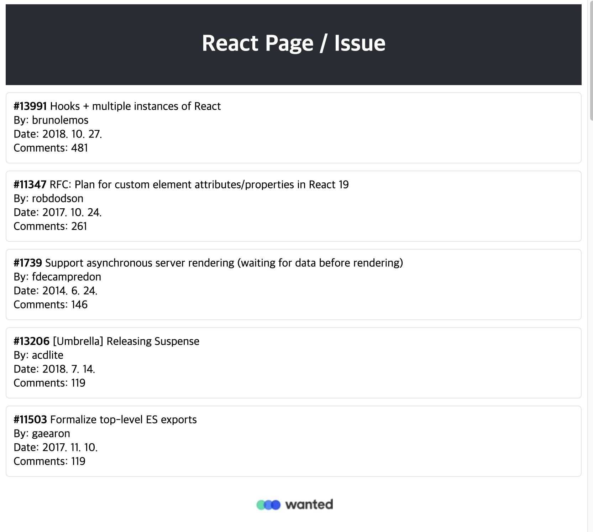
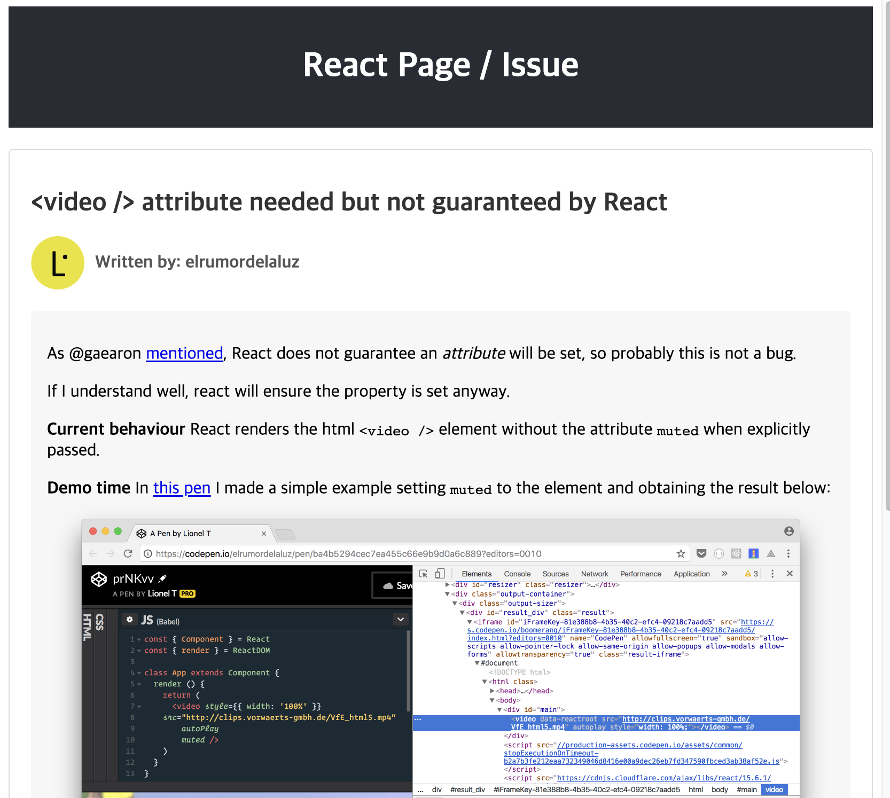

# 👹 원티드 프리온보딩 2주차 과제 👹

## 개요

- 🦁 본 페이지는 원티드 프리온보딩 인턴십 2주차 개인과제를 위한 리드미입니다.
- 🏨 해당 repository는 best practice를 선발하기 위한 사전 개인 과제입니다.
- 🌤️ 깃헙 이슈 전체 페이지, 상세 페이지로, 에러페리지로 구성되어 있습니다.

## 1. 프로젝트 목표

### 🎇코드의 효율성, 최선을 위한 방법 도모 등 개인이 팀과 작업하기에 앞서 동료들이 이해하기 쉬운 코드를 작성하는 것이 목표이다,🎇

## 2. 개발 환경 및 배포 URL

[🔗 배포링크](http://wanted-16team.s3-website.ap-northeast-2.amazonaws.com/)

## 3. 프로젝트 구조

## 4. 기술 스택

   

## 5. UI

### 1. 이슈 페이지

### 2. 상세 페이지

### 3. 에러 페이지

   
